# RaftKV Studio

> **RaftKV Studio: Interactive Raft Consensus Key-Value Store**
> A phased distributed-systems portfolio project with a C++20 Raft core, a
> Python control-plane API, Docker-based backend checks, and a modern
> React/TypeScript dashboard for demonstrating consensus behavior.

RaftKV Studio is built as a learning and engineering-practice project. Each
phase adds one major capability, keeps tests close to the implementation, and
leaves behind documentation that explains what changed and why.

---

## Table of Contents

- [Current Status](#current-status)
- [What Is Implemented](#what-is-implemented)
- [What Is Not Implemented Yet](#what-is-not-implemented-yet)
- [Quick Start](#quick-start)
- [System Architecture](#system-architecture)
- [Architecture Diagram](#architecture-diagram)
- [Node Internal Architecture](#node-internal-architecture)
- [Write Flow](#write-flow-put-key-value)
- [Read Flow](#read-flow-get-key)
- [Leader Election Flow](#leader-election-flow)
- [Follower Catch-Up Flow](#follower-catch-up-flow)
- [No Quorum Flow](#no-quorum-flow)
- [Split-Brain Prevention](#split-brain-prevention)
- [Snapshots and Log Compaction](#snapshots-and-log-compaction)
- [Event and Demo Architecture](#event-and-demo-architecture)
- [UI Dashboard](#ui-dashboard)
- [Demo Scripts](#demo-scripts)
- [Testing Strategy](#testing-strategy)
- [Project Structure](#project-structure)
- [Documentation Links](#documentation-links)
- [Resume Bullets](#resume-bullets)
- [Future Improvements](#future-improvements)

---

## Current Status

This repository currently implements a deterministic, testable Raft learning
system rather than a full production database.

The strongest parts today are:

- C++20 Raft domain model and in-process 3-node cluster tests.
- Quorum replication, no-quorum rejection, follower catch-up, failover, and
  snapshot install behavior.
- File-backed storage primitives for Raft log, metadata, and KV state.
- Protobuf/gRPC contracts plus RPC mapper tests.
- Python standard-library control plane for demos and UI data.
- React/TypeScript dashboard with live topology, command terminal, node
  controls, guided demos, event timeline, KV state, and snapshot status.
- Docker backend build/test workflow.
- GitHub Actions CI for backend, control plane, UI, and demo scripts.

The dashboard currently talks to the Python control-plane simulation. The C++
backend tests are the source of truth for Raft correctness behavior.

---

## What Is Implemented

Backend:

- C++20 CMake backend.
- In-memory KV state machine.
- Raft log append, lookup, conflict replacement, commit index advancement, and
  compaction.
- Deterministic in-process cluster.
- Quorum commit behavior.
- Follower catch-up.
- Leader failover.
- Snapshot creation and far-behind follower snapshot install.
- File-backed log, metadata, and KV store primitives.
- Protobuf/gRPC contracts and mapper tests.
- Docker build/test path.

Control plane:

- Python HTTP API.
- Cluster status endpoint.
- Command endpoint.
- Fault controls.
- Event history.
- Guided demos.
- Snapshot creation endpoint.

Frontend:

- React + TypeScript + Vite.
- Modern interactive cluster dashboard.
- Command terminal.
- Node start/stop/isolate/heal controls.
- Guided demo buttons.
- Event timeline.
- KV state viewer.
- Snapshot/log compaction status.

Dev workflow:

- One-command local dev stack with `./scripts/run_dev.sh`.
- Cleanup script with `./scripts/stop_dev.sh`.
- Test and demo scripts.
- Phase-by-phase documentation.

---

## What Is Not Implemented Yet

These are intentionally not presented as completed:

- No `kvctl` CLI yet.
- No live multi-process C++ Raft server loop yet.
- No end-to-end gRPC control-plane-to-node orchestration yet.
- No RocksDB integration yet; current persistence is file-backed primitives.
- No WebSocket stream yet; UI polls HTTP endpoints.
- No dynamic membership changes.
- No linearizable read barrier implementation.
- No production authentication, TLS, or deployment hardening.
- No Jepsen-style external fault testing.

---

## Quick Start

From the repository root:

```bash
git status --short --branch
git pull origin main
```

Run all main checks:

```bash
./scripts/test_backend.sh
./scripts/test_control_plane.sh
./scripts/test_ui.sh
./scripts/demo_all.sh
```

Run Docker backend check, if Docker is running:

```bash
./scripts/docker_test_backend.sh
```

Start the full local app:

```bash
./scripts/run_dev.sh
```

Open:

```text
http://127.0.0.1:5173
```

Stop stale local dev servers:

```bash
./scripts/stop_dev.sh
```

Run control plane and UI separately:

```bash
./scripts/run_control_plane.sh
./scripts/run_ui.sh
```

---

## System Architecture

The current architecture has two layers:

- The **C++ backend** contains the tested Raft behavior.
- The **control plane + UI** provide deterministic demos and visualization.

The future architecture will replace the control-plane simulation with live
gRPC clients connected to C++ node processes.

### High-Level ASCII Architecture

```text
+--------------------------------------------------------------------------------+
|                              RaftKV Studio UI                                   |
|                         React + TypeScript Dashboard                            |
|                                                                                |
|  +------------------+  +------------------+  +-------------------------------+ |
|  | Cluster Topology |  | Command Terminal |  | Event Timeline                | |
|  +------------------+  +------------------+  +-------------------------------+ |
|  | Node Controls    |  | KV State Viewer  |  | Fault Injection + Demo Runner | |
|  +------------------+  +------------------+  +-------------------------------+ |
+---------------------------------------+----------------------------------------+
                                        |
                                        | HTTP polling through Vite proxy
                                        |
+---------------------------------------v----------------------------------------+
|                              Control Plane API                                 |
|                         Python standard-library HTTP                           |
|                                                                                |
|  +-------------------+   +-------------------+   +---------------------------+ |
|  | Cluster API       |   | Command API       |   | Event History API         | |
|  +-------------------+   +-------------------+   +---------------------------+ |
|  | Fault API         |   | Demo API          |   | Snapshot API              | |
|  +-------------------+   +-------------------+   +---------------------------+ |
+---------------------------------------+----------------------------------------+
                                        |
                                        | deterministic simulation today
                                        | future: gRPC clients
                                        |
+---------------------------------------v----------------------------------------+
|                              C++ RaftKV Core                                   |
|                                                                                |
|  Raft log | Raft node | In-process cluster | File storage | Protobuf/gRPC maps |
+--------------------------------------------------------------------------------+
```

---

## Architecture Diagram

This diagram shows the current working system plus the future gRPC boundary.

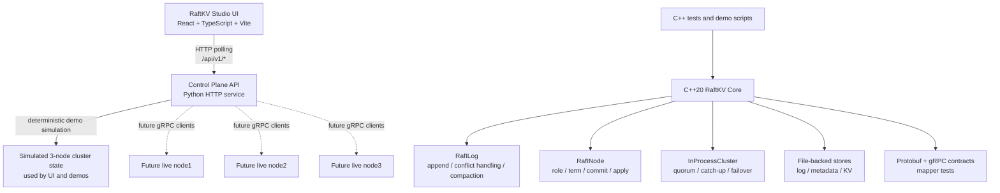

---

## Node Internal Architecture

The implemented C++ backend is currently a library-style core with tests. It is
not yet a full live Raft server process.

### ASCII Node Diagram

```text
+--------------------------------------------------------------------------------+
|                              C++ RaftKV Core                                    |
|                                                                                |
|  +-----------------------------+        +------------------------------------+ |
|  |        RaftNode             |        |        InProcessCluster            | |
|  |-----------------------------|        |------------------------------------| |
|  | role                        |        | leader tracking                    | |
|  | currentTerm                 |        | quorum replication                 | |
|  | votedFor                    |        | follower catch-up                  | |
|  | commitIndex                 |        | failover scenarios                 | |
|  | lastApplied                 |        | snapshot install                   | |
|  +--------------+--------------+        +----------------+-------------------+ |
|                 |                                        |                     |
|                 v                                        v                     |
|  +-----------------------------+        +------------------------------------+ |
|  |        RaftLog              |        |        KV State Machine            | |
|  |-----------------------------|        |------------------------------------| |
|  | append entries              |        | PUT / GET / DELETE                 | |
|  | detect conflicts            |        | apply committed commands           | |
|  | advance commit index        |        | snapshot / restore state           | |
|  | compact after snapshot      |        +------------------------------------+ |
|  +--------------+--------------+                                             |
|                 |                                                            |
|                 v                                                            |
|  +-----------------------------+        +------------------------------------+ |
|  | File Storage Primitives     |        | Protobuf / gRPC Contracts         | |
|  | log / metadata / KV files   |        | request mapping tests             | |
|  +-----------------------------+        +------------------------------------+ |
+--------------------------------------------------------------------------------+
```

### Mermaid Node Diagram

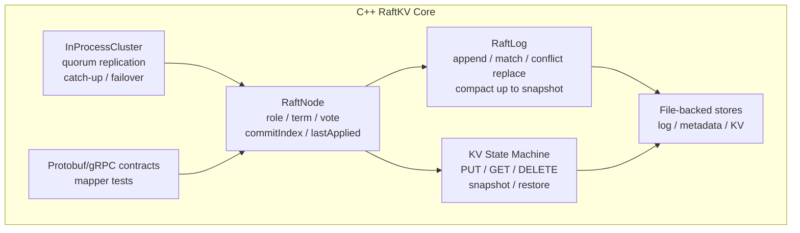

---

## Write Flow: `PUT key value`

Current demo writes go through the Python control plane simulation. The C++
backend tests prove the same quorum-commit behavior in `InProcessCluster`.

### ASCII Write Flow

```text
Dashboard or HTTP client
   |
   | POST /api/v1/commands
   v
Control Plane API
   |
   | Find current simulated leader
   v
Leader state
   |
   | Append command at next log index
   | Count available nodes as acknowledgements
   v
Majority reached?
   |
   +-- yes --> commit entry --> apply to KV state --> return committed=true
   |
   +-- no  --> emit QUORUM_LOST --> return committed=false
```

### Mermaid Write Flow

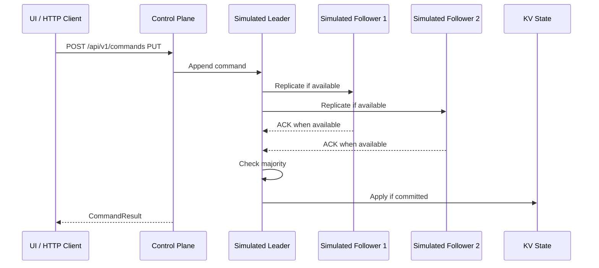

---

## Read Flow: `GET key`

Current reads are simple control-plane state reads. A full linearizable Raft
read barrier is future work.

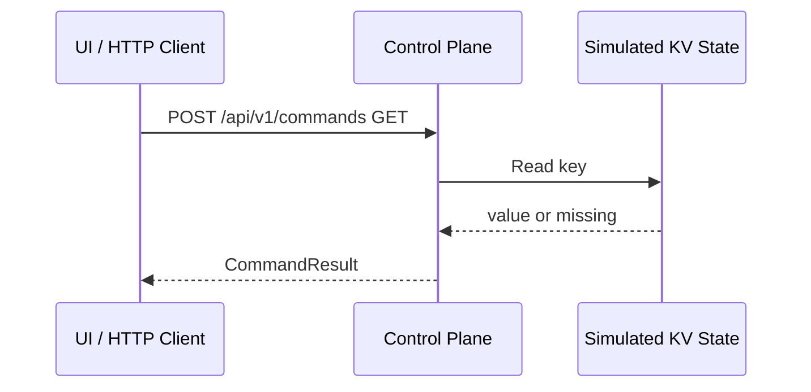

---

## Leader Election Flow

The backend contains deterministic election/leader-tracking tests. The control
plane also simulates leader changes during failover and partition demos.

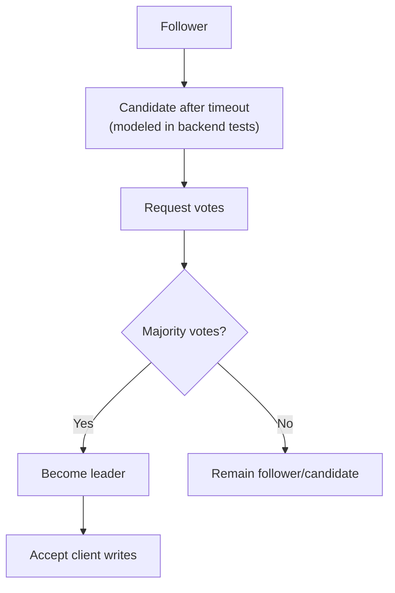

---

## Follower Catch-Up Flow

The C++ `InProcessCluster` tests prove that a follower can miss committed
entries and later catch up.

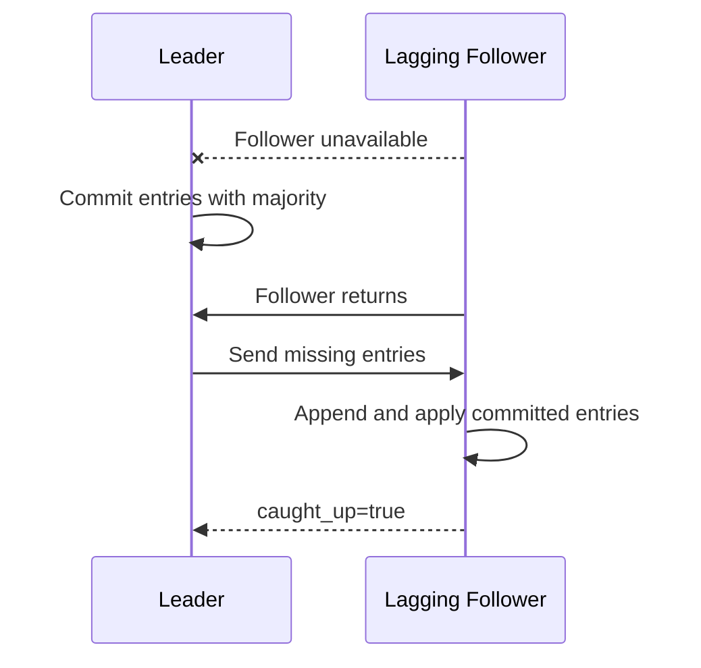

---

## No Quorum Flow

In a 3-node cluster, majority is 2. With only one available node, writes cannot
commit.

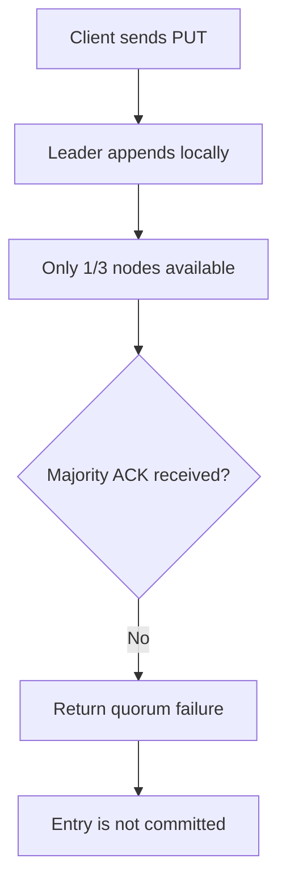

Run:

```bash
./scripts/demo_no_quorum.sh
```

---

## Split-Brain Prevention

The network partition demo shows the majority side electing a new leader, and
the old isolated leader stepping down after healing.

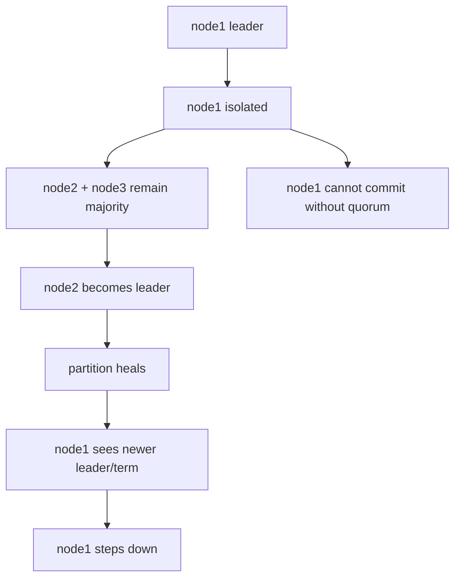

Run:

```bash
./scripts/demo_network_partition.sh
```

---

## Snapshots and Log Compaction

The backend supports snapshot metadata, state-machine snapshots, log
compaction, and far-behind follower snapshot install in tests.

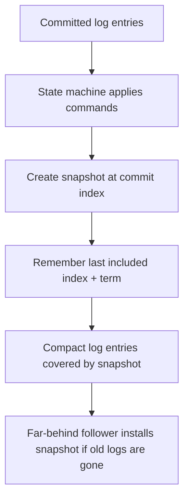

Run:

```bash
./scripts/demo_snapshot_install.sh
```

---

## Event and Demo Architecture

Current event data is stored by the Python control-plane service and returned
through `/api/v1/events`. The UI polls these endpoints. A live backend event
stream is future work.

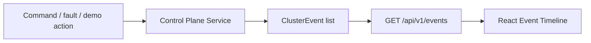

Current event types include:

```text
NODE_STARTED
NODE_STOPPED
BECAME_LEADER
LOG_APPENDED
ENTRY_COMMITTED
ENTRY_APPLIED
NETWORK_PARTITIONED
QUORUM_LOST
STALE_TERM_REJECTED
SNAPSHOT_CREATED
LOG_COMPACTED
SNAPSHOT_INSTALLED
```

---

## UI Dashboard

The UI is an operator-style dashboard, not a marketing page.

```text
+--------------------------------------------------------------------------------+
| RaftKV Studio                                  leader / quorum / snapshot stats |
+--------------------------------------------------------------------------------+
| Cluster map with animated links                 | Command terminal             |
| node1 / node2 / node3                            | PUT / GET / DELETE           |
| selectable nodes                                 | command result + ACK count   |
+--------------------------------------------------+-----------------------------+
| Selected node details                            | Guided failure demos         |
| role / term / commit / applied / snapshot        | no quorum / failover /       |
| Start / Stop / Isolate / Heal                    | partition / snapshot install |
+--------------------------------------------------+-----------------------------+
| Event timeline                                   | KV state                     |
| latest cluster events                            | committed key-value state    |
+--------------------------------------------------------------------------------+
```

Frontend map:

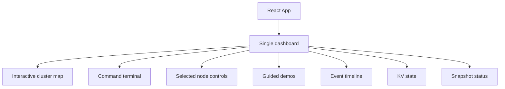

---

## Demo Scripts

```bash
./scripts/demo_leader_election.sh
./scripts/demo_log_replication.sh
./scripts/demo_follower_catchup.sh
./scripts/demo_leader_failover.sh
./scripts/demo_no_quorum.sh
./scripts/demo_network_partition.sh
./scripts/demo_snapshot_install.sh
./scripts/demo_control_plane.sh
./scripts/demo_all.sh
```

---

## Testing Strategy

Run all core checks:

```bash
./scripts/test_backend.sh
./scripts/test_control_plane.sh
./scripts/test_ui.sh
./scripts/demo_all.sh
```

Docker backend check:

```bash
./scripts/docker_test_backend.sh
```

Current test coverage includes:

| Area | Covered By |
|---|---|
| KV state machine | `state_machine_test.cpp` |
| Raft log behavior | `raft_log_test.cpp` |
| Node/election model | `raft_node_test.cpp` |
| Quorum replication | `replication_test.cpp` |
| Follower catch-up and failover | `failover_test.cpp` |
| File-backed storage | `storage_test.cpp` |
| Snapshots and compaction | `snapshot_test.cpp` |
| gRPC/protobuf mapping | `rpc_mapper_test.cpp` |
| Control-plane API | `control-plane/tests/test_control_plane.py` |
| UI production build | `./scripts/test_ui.sh` |

---

## Project Structure

```text
backend/        C++20 RaftKV core, storage primitives, protobuf/gRPC contracts
control-plane/  Python HTTP API used by demos and UI
ui/             React/TypeScript/Vite dashboard
scripts/        Build, test, run, stop, Docker, and demo scripts
docs/           Phase notes, runbook, architecture, testing, interview guide
.github/        CI workflows
```

---

## Documentation Links

Core docs:

- [Project Demonstration Runbook](docs/PROJECT_DEMONSTRATION_RUNBOOK.md)
- [Demo Guide](docs/DEMO_GUIDE.md)
- [Testing Strategy](TESTING.md)
- [Architecture Design](DESIGN.md)
- [Interview Guide](docs/INTERVIEW_GUIDE.md)
- [Phase Plan](docs/PHASE_PLAN.md)

Phase notes:

- [Phase 1: Backend Skeleton](docs/phase-1-backend-skeleton.md)
- [Phase 2: In-Memory KV State Machine](docs/phase-2-in-memory-kv-state-machine.md)
- [Phase 3: Raft Log Core](docs/phase-3-raft-log-core.md)
- [Phase 4: In-Process Raft Cluster](docs/phase-4-in-process-raft-cluster.md)
- [Phase 5: Quorum Log Replication](docs/phase-5-quorum-log-replication.md)
- [Phase 6: Follower Catch-Up and Failover](docs/phase-6-follower-catchup-failover.md)
- [Phase 7: Persistent Raft Storage](docs/phase-7-persistent-raft-storage.md)
- [Phase 8: gRPC Raft RPC](docs/phase-8-grpc-raft-rpc.md)
- [Phase 9: Docker Demo Cluster](docs/phase-9-docker-demo-cluster.md)
- [Phase 10: Control Plane API](docs/phase-10-control-plane-api.md)
- [Phase 11: Raft Observability UI](docs/phase-11-raft-observability-ui.md)
- [Phase 12: Fault Injection Demos](docs/phase-12-fault-injection-demos.md)
- [Phase 13: Snapshots and Log Compaction](docs/phase-13-snapshots-log-compaction.md)
- [Phase 14: Portfolio Polish](docs/phase-14-portfolio-polish.md)
- [Phase 15: Modern Interactive UI](docs/phase-15-modern-interactive-ui.md)

---

## Resume Bullets

- Built a C++20 Raft-based distributed key-value store core with leader
  modeling, quorum replication, follower catch-up, failover scenarios,
  persistent storage primitives, snapshots, and log compaction.

- Designed a deterministic 3-node in-process Raft test harness that validates
  safety scenarios including no-quorum rejection, committed-state preservation
  after failover, network partition recovery, and far-behind follower snapshot
  installation.

- Implemented a Python control-plane API and React/TypeScript observability
  dashboard for running consensus demos, issuing KV commands, injecting faults,
  visualizing topology, and inspecting event timelines.

- Established production-style engineering practices with phase-based Git
  branches, focused commits, Docker backend tests, GitHub Actions CI, demo
  scripts, runbooks, architecture docs, and an interview-ready guide.

---

## Future Improvements

```text
• Live multi-process C++ Raft node server
• Control-plane gRPC clients connected to live nodes
• Durable snapshot files
• RocksDB storage engine option
• Linearizable read barrier / ReadIndex
• kvctl CLI
• WebSocket/SSE event stream
• Authentication for control plane
• TLS between nodes
• Prometheus metrics
• Dynamic membership changes
• Jepsen-style external fault testing
• Kubernetes deployment
```

---

## Project Status

RaftKV Studio is a working distributed-systems learning platform with tested
Raft core behaviors and an interactive demo UI. It is intentionally honest about
the line between what is implemented today and what belongs to future production
hardening.
