# RaftKV Studio

> A production-style **distributed key-value store** built in **C++20** using **Raft consensus**, with a modern **React/TypeScript observability dashboard** to visually demonstrate leader election, log replication, quorum commits, failover, no-quorum behavior, follower catch-up, snapshots, and split-brain prevention.

---

## Table of Contents

- [What Is RaftKV Studio?](#what-is-raftkv-studio)
- [Why This Project Matters](#why-this-project-matters)
- [System Architecture](#system-architecture)
- [Architecture Diagram](#architecture-diagram)
- [Node Internal Architecture](#node-internal-architecture)
- [Write Flow](#write-flow-put-key-value)
- [Read Flow](#read-flow-get-key)
- [Leader Election Flow](#leader-election-flow)
- [Heartbeat Flow](#heartbeat-flow)
- [Follower Catch-Up Flow](#follower-catch-up-flow)
- [No Quorum Flow](#no-quorum-flow)
- [Split-Brain Prevention](#split-brain-prevention)
- [Message Failure Handling](#message-failure-handling)
- [Snapshots and Log Compaction](#snapshots-and-log-compaction)
- [Event Streaming Architecture](#event-streaming-architecture)
- [UI Dashboard](#ui-dashboard)
- [Guided Demo Scenarios](#guided-demo-scenarios)
- [Final Project Structure](#final-project-structure)
- [Testing Strategy](#testing-strategy)
- [AI-Assisted Testing Methodology](#ai-assisted-testing-methodology)
- [Resume Bullets](#resume-bullets)
- [Interview Explanation](#interview-explanation)

---

# What Is RaftKV Studio?

**RaftKV Studio** is a distributed key-value database where data is stored across multiple nodes. The system uses the **Raft consensus algorithm** so all nodes agree on:

```text
1. Who the leader is
2. Which writes are accepted
3. What order writes happen in
4. Which writes are committed
5. Which data is safe to apply to the database
```

The system supports simple operations:

```bash
kvctl put user:1 Abhishek
kvctl get user:1
kvctl delete user:1
```

But internally, each write goes through a real distributed consensus flow:

```text
Client request
   ↓
Leader appends command to Raft log
   ↓
Leader replicates command to followers
   ↓
Majority acknowledges
   ↓
Entry is committed
   ↓
Entry is applied to the key-value database
```

---

# Why This Project Matters

Most resume projects show that you can build APIs.

This project shows that you understand how **real backend infrastructure stays correct when machines crash, networks delay messages, and leaders fail**.

This project demonstrates:

```text
• C++ systems programming
• Networking with gRPC
• Protobuf serialization
• Disk persistence with RocksDB
• Leader election
• Heartbeats
• Quorum commits
• Log replication
• Crash recovery
• Snapshots
• Log compaction
• Thread safety
• Failure handling
• Observability
• Fault-injection testing
```

This makes it suitable for:

```text
• Distributed systems roles
• Backend infrastructure roles
• Storage/database engineering roles
• Platform engineering roles
• Cloud systems roles
```

---

# Tech Stack

## Backend

| Area | Technology |
|---|---|
| Language | C++20 |
| Consensus | Raft |
| RPC | gRPC |
| Serialization | Protobuf |
| Storage | RocksDB |
| Build System | CMake |
| Testing | GoogleTest |
| Containers | Docker / Docker Compose |
| Concurrency | Threads, mutexes, condition variables, atomics |

## Control Plane

| Area | Technology |
|---|---|
| API Gateway | FastAPI / Node.js / C++ Gateway |
| Backend communication | gRPC |
| Frontend communication | HTTP + WebSocket |
| Purpose | Cluster inspection, commands, demo orchestration, event streaming |

## Frontend

| Area | Technology |
|---|---|
| Framework | React |
| Language | TypeScript |
| Styling | Tailwind CSS |
| UI Components | shadcn/ui |
| Cluster Graph | React Flow |
| Terminal | xterm.js or custom terminal |
| Live Updates | WebSocket |
| Charts | Recharts |

---

# System Architecture

## High-Level ASCII Architecture

This diagram is visible in any markdown viewer.

```text
+--------------------------------------------------------------------------------+
|                              RaftKV Studio UI                                   |
|                         React + TypeScript Dashboard                            |
|                                                                                |
|  +------------------+  +------------------+  +-------------------------------+ |
|  | Cluster Topology |  | Command Terminal |  | Live Event Timeline           | |
|  +------------------+  +------------------+  +-------------------------------+ |
|  | Replicated Logs  |  | KV State Viewer  |  | Fault Injection + Demo Runner | |
|  +------------------+  +------------------+  +-------------------------------+ |
+---------------------------------------+----------------------------------------+
                                        |
                                        | HTTP / WebSocket
                                        |
+---------------------------------------v----------------------------------------+
|                            Control Plane Gateway                               |
|                                                                                |
|  +-------------------+   +-------------------+   +---------------------------+ |
|  | Cluster API       |   | Command API       |   | WebSocket Event Stream    | |
|  +-------------------+   +-------------------+   +---------------------------+ |
|  | Fault API         |   | Demo API          |   | Node Debug Clients        | |
|  +-------------------+   +-------------------+   +---------------------------+ |
+--------------------+-------------------+--------------------+-----------------+
                     |                   |                    |
                     | gRPC              | gRPC               | gRPC
                     |                   |                    |
        +------------v-------+   +-------v------------+   +---v----------------+
        |   RaftKV Node 1    |   |   RaftKV Node 2    |   |   RaftKV Node 3    |
        |   C++20 + gRPC     |   |   C++20 + gRPC     |   |   C++20 + gRPC     |
        |   RocksDB          |   |   RocksDB          |   |   RocksDB          |
        +---------+----------+   +----------+---------+   +---------+----------+
                  ^                         ^                       ^
                  |                         |                       |
                  |       Raft RPCs         |       Raft RPCs       |
                  +-------------------------+-----------------------+
                  |  RequestVote / AppendEntries / InstallSnapshot  |
                  +-------------------------------------------------+
```

---

# Architecture Diagram

GitHub will render this Mermaid diagram.

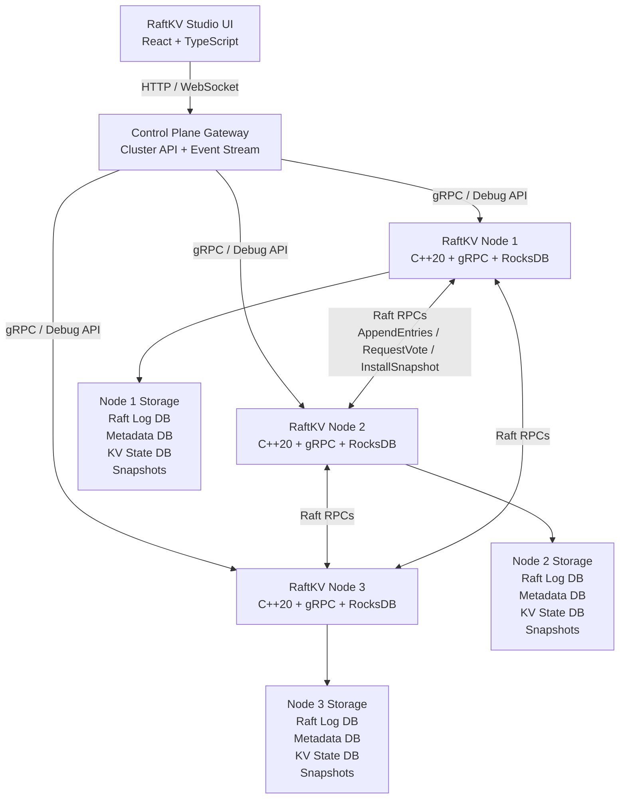

---

# Node Internal Architecture

Each node is a full C++ process with networking, Raft state, persistent storage, background threads, and an event bus.

## ASCII Node Diagram

```text
+--------------------------------------------------------------------------------+
|                                RaftKV Node                                      |
|                                                                                |
|  +-----------------------------+        +------------------------------------+ |
|  |        gRPC Server          |        |        Peer gRPC Clients           | |
|  |-----------------------------|        |------------------------------------| |
|  | KVService                   |        | Send RequestVote                   | |
|  | RaftService                 |        | Send AppendEntries                 | |
|  | DebugService                |        | Send InstallSnapshot               | |
|  +--------------+--------------+        +----------------+-------------------+ |
|                 |                                        |                     |
|                 v                                        v                     |
|  +------------------------------------------------------------------------------+
|  |                              RaftNode Core                                   |
|  |------------------------------------------------------------------------------|
|  | role: Follower / Candidate / Leader                                          |
|  | currentTerm                                                                  |
|  | votedFor                                                                     |
|  | leaderId                                                                     |
|  | commitIndex                                                                  |
|  | lastApplied                                                                  |
|  | nextIndex[follower]                                                          |
|  | matchIndex[follower]                                                         |
|  +------------+--------------------+---------------------+----------------------+
|               |                    |                     |                      |
|               v                    v                     v                      |
|  +---------------------+  +--------------------+  +--------------------------+ |
|  | RocksDB Raft Log    |  | RocksDB Metadata   |  | Apply Worker Thread      | |
|  | index -> LogEntry   |  | term, vote, snap   |  | commitIndex -> KV apply  | |
|  +----------+----------+  +--------------------+  +------------+-------------+ |
|             |                                                 |               |
|             v                                                 v               |
|  +---------------------+                          +-------------------------+ |
|  | Snapshot Store      |                          | RocksDB KV State Machine| |
|  | snapshot_N.snap     |                          | key -> value            | |
|  +---------------------+                          +-------------------------+ |
|                                                                                |
|  +--------------------------------------------------------------------------+ |
|  | Event Bus                                                                 | |
|  | BECAME_LEADER, HEARTBEAT_SENT, LOG_APPENDED, ENTRY_COMMITTED, etc.        | |
|  +--------------------------------------------------------------------------+ |
+--------------------------------------------------------------------------------+
```

## Mermaid Node Diagram

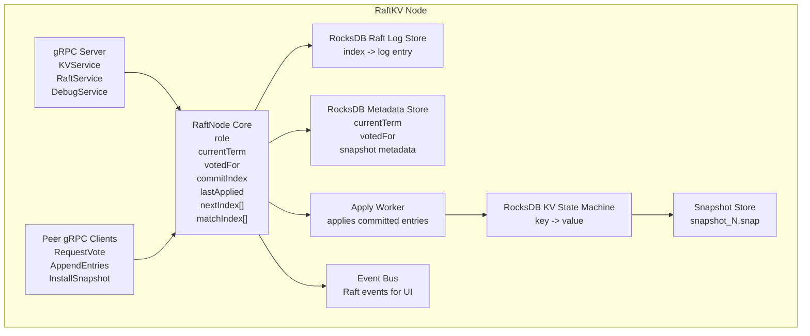

---

# Write Flow: `PUT key value`

A write is accepted by the leader, replicated to followers, committed after majority acknowledgement, and then applied to the KV database.

## ASCII Write Flow

```text
Client/UI
   |
   | PUT user:1 Abhishek
   v
Control Plane Gateway
   |
   | Forward to current leader
   v
Leader Node
   |
   | 1. Serialize command
   | 2. Append command to local Raft log
   | 3. Persist log entry to disk
   v
Followers
   |
   | AppendEntries RPC
   | Validate previous log index and term
   | Append log entry
   | Persist log entry to disk
   | Send ACK
   v
Leader
   |
   | Majority ACK received
   | commitIndex advances
   | apply thread wakes up
   v
KV State Machine
   |
   | PUT user:1 Abhishek
   v
Client receives success
```

## Mermaid Write Flow

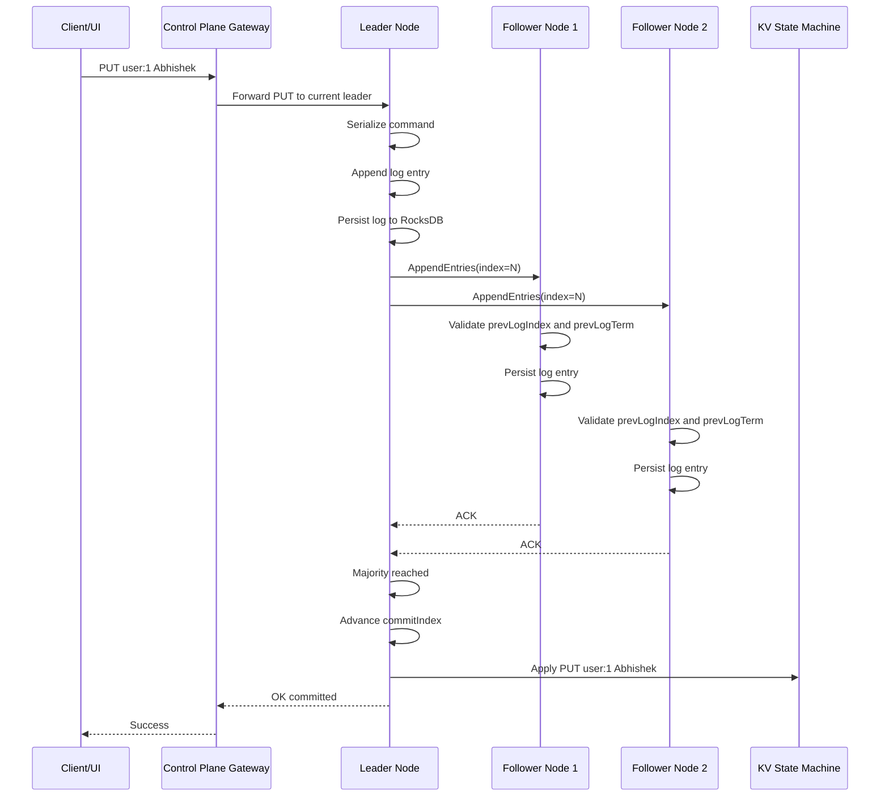

## Key Point

A follower should not acknowledge the append until the log entry is durably persisted.

```text
append log entry -> persist to disk -> send ACK
```

---

# Read Flow: `GET key`

For correctness, reads should be linearizable.

RaftKV Studio uses a leader-based read barrier.

## ASCII Read Flow

```text
Client/UI
   |
   | GET user:1
   v
Control Plane Gateway
   |
   | Forward to leader
   v
Leader
   |
   | Confirm it is still leader using quorum/read barrier
   | Ensure state machine is applied up to commitIndex
   v
RocksDB KV Store
   |
   | Read key
   v
Return value to client
```

## Mermaid Read Flow

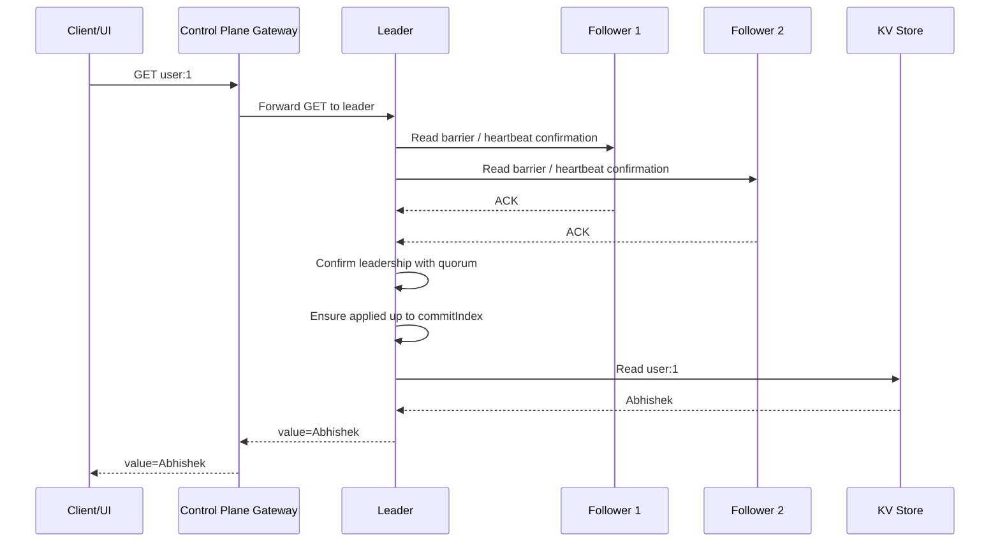

---

# Leader Election Flow

When a follower does not receive heartbeats before its randomized election timeout, it becomes a candidate.

## ASCII Leader Election Diagram

```text
+-----------+
| Follower  |
+-----+-----+
      |
      | No heartbeat before timeout
      v
+-----------+
| Candidate |
+-----+-----+
      |
      | increment term
      | vote for self
      | send RequestVote RPCs
      v
+----------------------+
| Majority votes?      |
+----------+-----------+
           |
      Yes  |  No
           |
           v
     +-----------+
     |  Leader   |
     +-----------+
```

## Mermaid Leader Election Flow

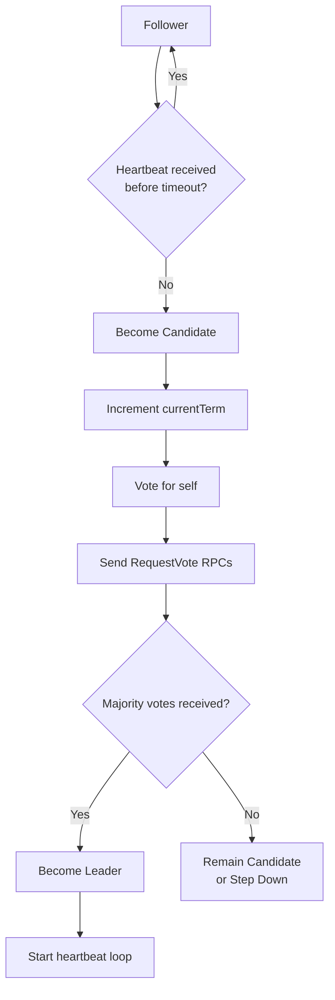

---

# Heartbeat Flow

Heartbeats are empty `AppendEntries` RPCs.

## ASCII Heartbeat Diagram

```text
          every 100ms
Leader  ------------------> Follower 1
Leader  ------------------> Follower 2

Follower receives heartbeat:
  1. Reset election timer
  2. Update leaderId
  3. Reject if leader term is stale
  4. Step down if request term is newer
```

## Mermaid Heartbeat Flow

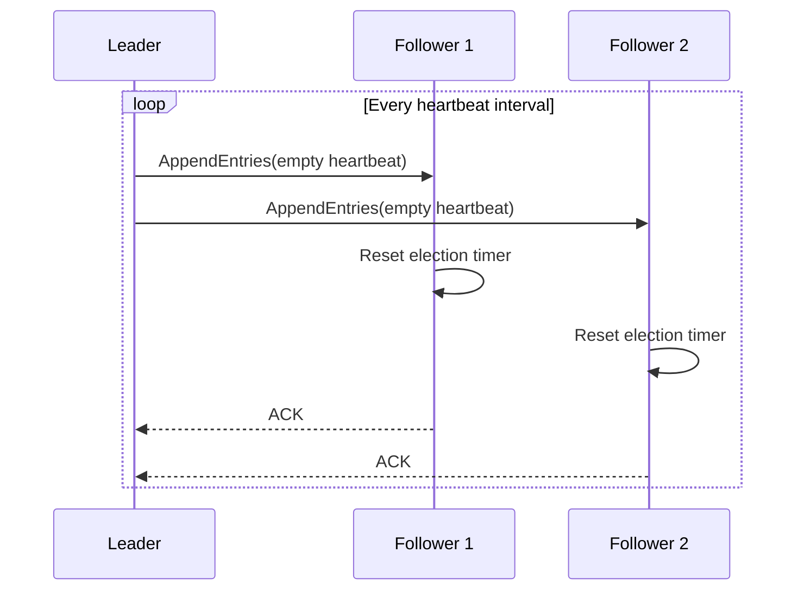

Recommended local demo settings:

```text
Heartbeat interval: 100 ms
Election timeout: randomized 300 ms - 600 ms
```

---

# Follower Catch-Up Flow

A follower can miss committed entries and later catch up.

Example:

```text
Node 1 stored entry
Node 2 stored entry
Node 3 missed entry

Majority reached: 2/3
Command committed
```

## ASCII Follower Catch-Up Diagram

```text
Before catch-up:

Leader log:  1  2  3  4  5  6  7
Node3 log:   1  2  3

Leader state:
nextIndex[node3]  = 4
matchIndex[node3] = 3

Leader sends:
4  5  6  7

After catch-up:

Leader log:  1  2  3  4  5  6  7
Node3 log:   1  2  3  4  5  6  7
```

## Mermaid Follower Catch-Up Flow

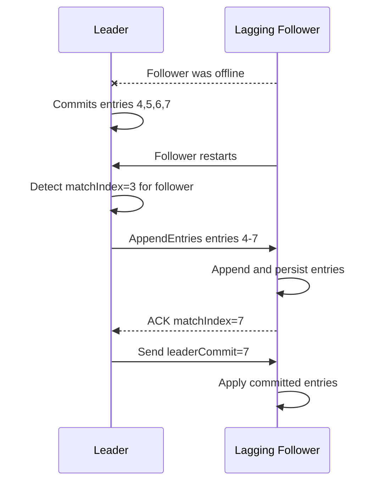

---

# No Quorum Flow

In a 3-node cluster:

```text
Majority = 2
```

If only one node is alive, writes cannot be safely committed.

## ASCII No Quorum Diagram

```text
Cluster size: 3
Majority required: 2

Node1: alive
Node2: down
Node3: down

Client sends PUT
      |
      v
Node1 appends locally
      |
      v
Tries to replicate
      |
      v
Only 1/3 available
      |
      v
Quorum not reached
      |
      v
Write fails
Entry is not committed
```

## Mermaid No Quorum Flow

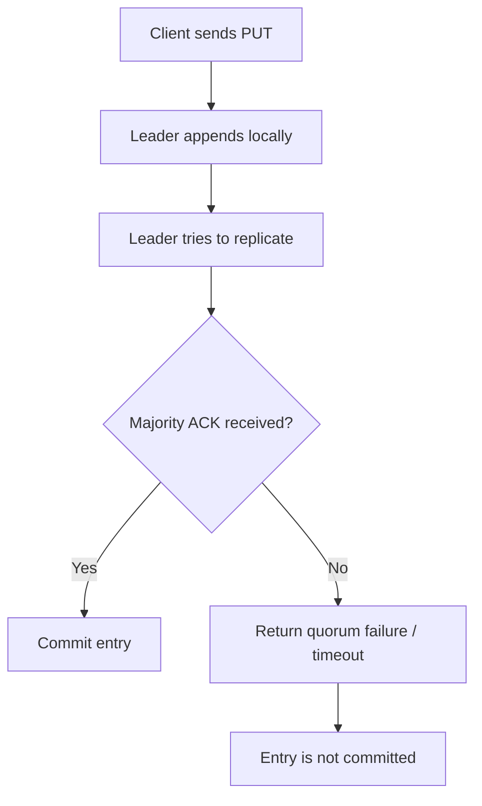

Important behavior:

```text
Raft prefers correctness over accepting unsafe writes.
```

---

# Split-Brain Prevention

A stale leader may temporarily believe it is still leader, but it cannot commit writes without majority.

## ASCII Split-Brain Diagram

```text
Initial state:

Node1 = Leader, term 4
Node2 = Follower
Node3 = Follower

Network partition:

        Node1 isolated

        Node2 <-----> Node3

Node2 and Node3 form majority.
Node2 becomes leader in term 5.

Node1 still thinks it is leader in term 4.
Client sends write to Node1.

Node1 cannot reach majority.
Write is not committed.

Partition heals.

Node1 sees higher term 5.
Node1 steps down to follower.
```

## Mermaid Split-Brain Flow

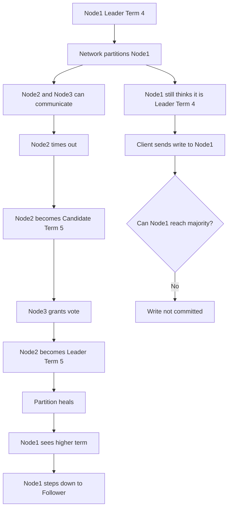

## Why Split-Brain Is Prevented

Raft prevents split-brain using:

```text
1. Terms
2. Majority voting
3. One vote per node per term
4. Quorum-based commits
5. Stale-term rejection
6. Log freshness checks
```

---

# Message Failure Handling

Raft is designed for unreliable networks.

Messages can be:

```text
• Delayed
• Lost
• Duplicated
• Reordered
```

## ASCII Message Validation Flow

```text
Follower receives AppendEntries
        |
        v
Is request term stale?
        |
   +----+----+
   |         |
  Yes        No
   |         |
Reject       Check prevLogIndex and prevLogTerm
             |
        +----+----+
        |         |
     Mismatch    Match
        |         |
     Reject      Append entries
                  |
                  v
             Persist to disk
                  |
                  v
              ACK leader
```

## Mermaid Message Handling Flow

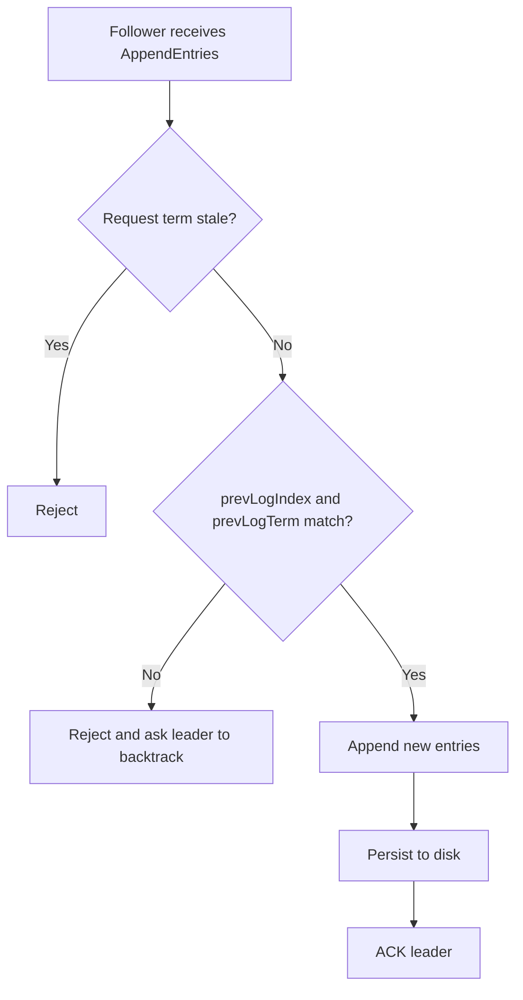

## Network Issue Handling Table

| Network Issue | How Raft Handles It |
|---|---|
| Delayed message | Rejected if the term is stale |
| Lost message | Leader retries RPC |
| Duplicate message | Follower ignores duplicate log entry |
| Reordered message | Follower rejects append if previous index/term does not match |

---

# Snapshots and Log Compaction

Raft logs cannot grow forever. Snapshots compact state.

## ASCII Snapshot Diagram

```text
Before snapshot:

Raft log:
1 2 3 4 5 6 7 8 9 10 ... 1000

KV state after applying log:
user:1  -> Abhishek
order:1 -> paid
city    -> Gainesville

Create snapshot at index 1000:

snapshot_1000.snap

After compaction:

Snapshot covers: 1 through 1000
Raft log starts from: 1001
```

## Mermaid Snapshot Flow

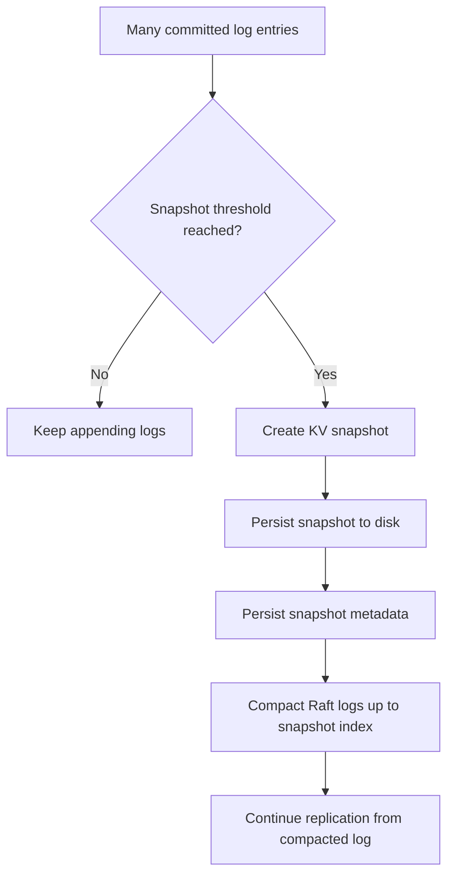

## Important Rule

Logs are **not deleted immediately** after being applied to the database.

Correct behavior:

```text
1. Apply committed logs to KV store
2. Keep logs for follower catch-up and recovery
3. Create durable snapshot
4. Compact logs covered by the snapshot
```

---

# Lagging Follower Snapshot Installation

If a follower is too far behind and the leader has already compacted the old logs, the leader sends a snapshot.

## ASCII Snapshot Install Diagram

```text
Node3 was offline for a long time.

Leader has:
snapshot_1000.snap
logs starting at 1001

Node3 asks for log index 200.

Leader no longer has log 200.
Leader sends InstallSnapshot(index=1000).

Node3 installs snapshot.
Node3 resumes replication from index 1001.
```

## Mermaid Snapshot Install Flow

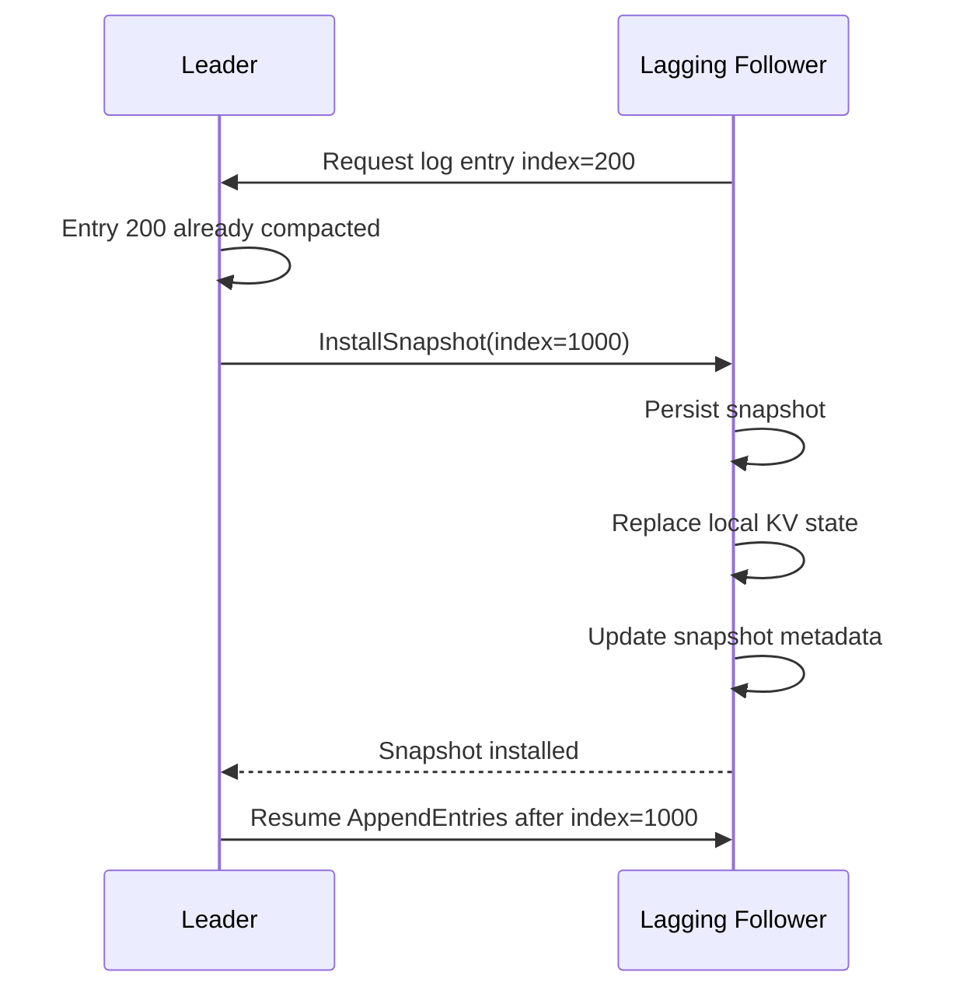

---

# Event Streaming Architecture

RaftKV Studio emits events from the backend and streams them to the frontend UI.

## ASCII Event Streaming Diagram

```text
Raft Node
   |
   | internal event emitted
   v
Event Bus
   |
   | Debug/Event gRPC stream
   v
Control Plane Gateway
   |
   | WebSocket
   v
React UI
   |
   +--> Event Timeline
   +--> Cluster Graph
   +--> Replicated Log Viewer
   +--> Demo Runner
```

## Mermaid Event Streaming Diagram

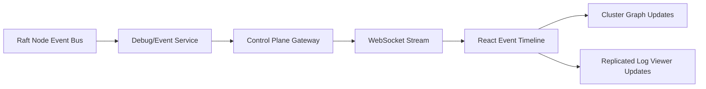

## Event Types

```text
NODE_STARTED
BECAME_FOLLOWER
BECAME_CANDIDATE
BECAME_LEADER
VOTE_REQUESTED
VOTE_GRANTED
HEARTBEAT_SENT
HEARTBEAT_RECEIVED
LOG_APPENDED
ENTRY_REPLICATED
ENTRY_COMMITTED
ENTRY_APPLIED
SNAPSHOT_CREATED
SNAPSHOT_INSTALLED
NODE_STOPPED
NETWORK_PARTITIONED
QUORUM_LOST
STALE_TERM_REJECTED
```

---

# UI Dashboard

The UI is built to look like a modern distributed-systems debugging environment.

## ASCII UI Layout

```text
+--------------------------------------------------------------------------------+
| RaftKV Studio                                             Cluster Healthy       |
+----------------+-----------------------------------------+---------------------+
| Sidebar        | Cluster Topology                         | Node Details        |
|                |                                         |                     |
| Dashboard      |        node1 -------- node2              | node1               |
| Demos          |          \            /                  | Role: Leader        |
| Faults         |           \          /                   | Term: 5             |
| Logs           |            \        /                    | Commit Index: 42    |
| Snapshots      |              node3                       | Last Applied: 42    |
+----------------+-----------------------------------------+---------------------+
| Command Terminal                         | Event Timeline                      |
|                                           |                                     |
| raftkv> put user:1 Abhishek              | [10:00:01] node1 became leader      |
| OK committed index=42                    | [10:00:03] appended log idx=42      |
| raftkv> get user:1                       | [10:00:03] quorum reached 2/3       |
| Abhishek                                 | [10:00:03] entry committed          |
+------------------------------------------+-------------------------------------+
| Replicated Log Viewer                                                          |
| index | term | command             | node1 | node2 | node3 | status             |
| 42    | 5    | PUT user:1 Abhishek | yes   | yes   | lag   | committed          |
+--------------------------------------------------------------------------------+
| KV State Viewer / Snapshot Status                                              |
+--------------------------------------------------------------------------------+
```

## Frontend Feature Map

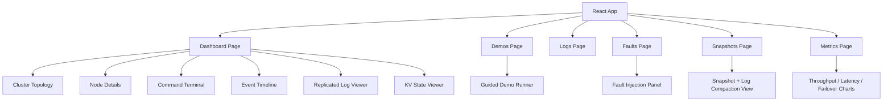

---

# Guided Demo Scenarios

The UI and scripts demonstrate each distributed systems property.

| Demo | What It Proves |
|---|---|
| Leader election | Exactly one leader is elected |
| Heartbeats | Followers do not start elections while leader is alive |
| Write replication | Writes are appended, replicated, committed, and applied |
| Follower catch-up | A down follower catches up after restart |
| Leader failover | A new leader is elected after leader crash |
| No quorum | Writes fail when majority is unavailable |
| Split-brain prevention | Old isolated leader cannot commit writes |
| Network faults | Delayed/lost/duplicated/reordered messages are handled |
| Crash recovery | Committed data survives restart |
| Snapshot recovery | Old logs are compacted after snapshots |
| Snapshot install | Far-behind follower recovers using snapshot |

---

# Recommended Demo Flow

```text
1. Start the 3-node cluster.
2. Open RaftKV Studio UI.
3. Show leader election.
4. Run PUT user:1 Abhishek.
5. Show the replicated log table.
6. Stop node3.
7. Run PUT order:101 paid.
8. Show commit with node1 + node2 majority.
9. Restart node3.
10. Show follower catch-up.
11. Kill the leader.
12. Show new leader election.
13. Partition old leader.
14. Show split-brain prevention.
15. Trigger snapshot.
16. Show log compaction.
```

---

# Demo Scripts

```bash
./scripts/demo_leader_election.sh
./scripts/demo_log_replication.sh
./scripts/demo_follower_catchup.sh
./scripts/demo_leader_failover.sh
./scripts/demo_no_quorum.sh
./scripts/demo_network_partition.sh
./scripts/demo_crash_recovery.sh
./scripts/demo_snapshot_recovery.sh
./scripts/demo_all.sh
```

---

# CLI Commands

The project includes a CLI called `kvctl`.

```bash
kvctl put user:1 Abhishek
kvctl get user:1
kvctl delete user:1
kvctl status
kvctl leader
kvctl wait-for-leader
kvctl inspect-node node1
kvctl inspect-log node1
kvctl inspect-snapshot node1
kvctl wait-for-sync node3
kvctl cluster-log
```

Example:

```text
Cluster status:

node1:
  role: LEADER
  term: 4
  commitIndex: 128
  lastApplied: 128
  lastLogIndex: 128

node2:
  role: FOLLOWER
  term: 4
  commitIndex: 128
  lastApplied: 128
  lastLogIndex: 128

node3:
  role: FOLLOWER
  term: 4
  commitIndex: 124
  lastApplied: 124
  lastLogIndex: 124
```

---

# Final Project Structure

```text
raftkv-studio/
├── README.md
├── DESIGN.md
├── TESTING.md
├── BENCHMARKS.md
├── docker-compose.yml
├── Dockerfile.backend
├── Dockerfile.control-plane
├── Dockerfile.ui
├── .gitignore
├── .github/
│   └── workflows/
│       ├── backend-ci.yml
│       ├── ui-ci.yml
│       └── integration-tests.yml
│
├── backend/
│   ├── CMakeLists.txt
│   ├── README.md
│   ├── proto/
│   │   ├── raft.proto
│   │   ├── kv.proto
│   │   ├── debug.proto
│   │   └── event.proto
│   ├── config/
│   │   ├── node1.yaml
│   │   ├── node2.yaml
│   │   └── node3.yaml
│   ├── include/
│   │   └── raftkv/
│   │       ├── common/
│   │       ├── config/
│   │       ├── raft/
│   │       ├── storage/
│   │       ├── kv/
│   │       ├── net/
│   │       ├── concurrency/
│   │       ├── events/
│   │       ├── debug/
│   │       └── fault/
│   ├── src/
│   │   ├── main.cpp
│   │   ├── common/
│   │   ├── config/
│   │   ├── raft/
│   │   ├── storage/
│   │   ├── kv/
│   │   ├── net/
│   │   ├── concurrency/
│   │   ├── events/
│   │   ├── debug/
│   │   └── fault/
│   ├── client/
│   │   ├── kvctl.cpp
│   │   └── CMakeLists.txt
│   ├── tests/
│   │   ├── unit/
│   │   ├── integration/
│   │   └── fault/
│   └── benchmarks/
│
├── control-plane/
│   ├── README.md
│   ├── package.json or requirements.txt
│   ├── src/
│   │   ├── main.ts or main.py
│   │   ├── api/
│   │   ├── clients/
│   │   ├── services/
│   │   ├── websocket/
│   │   └── types/
│   └── tests/
│
├── ui/
│   ├── package.json
│   ├── vite.config.ts
│   ├── tsconfig.json
│   ├── index.html
│   ├── README.md
│   ├── public/
│   │   └── raftkv-logo.svg
│   └── src/
│       ├── main.tsx
│       ├── App.tsx
│       ├── globals.css
│       ├── api/
│       ├── components/
│       │   ├── layout/
│       │   ├── cluster/
│       │   ├── terminal/
│       │   ├── events/
│       │   ├── raftlog/
│       │   ├── kv/
│       │   ├── faults/
│       │   ├── demos/
│       │   ├── snapshots/
│       │   ├── metrics/
│       │   └── shared/
│       ├── hooks/
│       ├── pages/
│       ├── store/
│       ├── types/
│       └── utils/
│
├── scripts/
│   ├── build_all.sh
│   ├── run_cluster.sh
│   ├── stop_cluster.sh
│   ├── reset_cluster.sh
│   ├── run_ui.sh
│   ├── demo_all.sh
│   ├── demo_leader_election.sh
│   ├── demo_log_replication.sh
│   ├── demo_follower_catchup.sh
│   ├── demo_leader_failover.sh
│   ├── demo_no_quorum.sh
│   ├── demo_network_partition.sh
│   ├── demo_crash_recovery.sh
│   ├── demo_snapshot_recovery.sh
│   └── benchmark.sh
│
├── docs/
│   ├── architecture.md
│   ├── raft-overview.md
│   ├── write-path.md
│   ├── read-path.md
│   ├── leader-election.md
│   ├── log-replication.md
│   ├── persistence.md
│   ├── snapshots.md
│   ├── fault-injection.md
│   ├── ui-demo-guide.md
│   ├── testing-strategy.md
│   ├── ai-assisted-testing.md
│   └── interview-guide.md
│
└── data/
    ├── node1/
    │   ├── raft-log/
    │   ├── raft-meta/
    │   ├── kv-state/
    │   └── snapshots/
    ├── node2/
    │   ├── raft-log/
    │   ├── raft-meta/
    │   ├── kv-state/
    │   └── snapshots/
    └── node3/
        ├── raft-log/
        ├── raft-meta/
        ├── kv-state/
        └── snapshots/
```

---

# Backend Folder Details

```text
backend/include/raftkv/raft/
├── raft_node.h
├── raft_state.h
├── raft_role.h
├── raft_log.h
├── log_entry.h
├── election_timer.h
├── heartbeat_manager.h
├── replication_manager.h
├── commit_manager.h
├── apply_worker.h
├── snapshot_manager.h
└── raft_rpc_service.h
```

```text
backend/include/raftkv/storage/
├── log_store.h
├── metadata_store.h
├── kv_store.h
├── snapshot_store.h
├── rocksdb_log_store.h
├── rocksdb_metadata_store.h
├── rocksdb_kv_store.h
└── snapshot_file_store.h
```

```text
backend/include/raftkv/concurrency/
├── thread_pool.h
├── blocking_queue.h
├── shutdown_latch.h
└── scoped_thread.h
```

---

# Frontend Folder Details

```text
ui/src/components/
├── layout/
│   ├── AppShell.tsx
│   ├── Header.tsx
│   ├── Sidebar.tsx
│   └── StatusBar.tsx
├── cluster/
│   ├── ClusterGraph.tsx
│   ├── NodeCard.tsx
│   ├── NodeBadge.tsx
│   ├── NodeDetailsPanel.tsx
│   ├── HeartbeatPulse.tsx
│   └── FollowerProgress.tsx
├── terminal/
│   ├── CommandTerminal.tsx
│   ├── TerminalInput.tsx
│   ├── TerminalOutput.tsx
│   └── CommandHelp.tsx
├── events/
│   ├── EventTimeline.tsx
│   ├── EventRow.tsx
│   ├── EventFilters.tsx
│   └── EventTypeBadge.tsx
├── raftlog/
│   ├── ReplicatedLogTable.tsx
│   ├── LogEntryRow.tsx
│   ├── CommitIndexMarker.tsx
│   ├── AppliedIndexMarker.tsx
│   └── LogReplicationCell.tsx
├── faults/
│   ├── FaultInjectionPanel.tsx
│   ├── KillLeaderButton.tsx
│   ├── NodeControlPanel.tsx
│   ├── NetworkPartitionControl.tsx
│   ├── MessageDelayControl.tsx
│   └── FaultStatusCard.tsx
└── demos/
    ├── DemoRunner.tsx
    ├── DemoScenarioList.tsx
    ├── DemoStepCard.tsx
    ├── DemoProgress.tsx
    └── DemoResult.tsx
```

---

# Testing Strategy

## Unit Tests

```text
raft_log_test.cpp
metadata_store_test.cpp
command_codec_test.cpp
election_timer_test.cpp
state_machine_test.cpp
snapshot_manager_test.cpp
```

## Integration Tests

```text
leader_election_test.cpp
log_replication_test.cpp
follower_catchup_test.cpp
leader_failover_test.cpp
no_quorum_test.cpp
crash_recovery_test.cpp
snapshot_install_test.cpp
```

## Fault-Injection Tests

```text
delayed_message_test.cpp
dropped_message_test.cpp
duplicate_message_test.cpp
reordered_message_test.cpp
stale_term_test.cpp
network_partition_test.cpp
```

## Test Matrix

| Test | Expected Behavior |
|---|---|
| Leader election | Exactly one leader elected |
| Log replication | Entry replicated to majority before commit |
| Follower catch-up | Lagging follower receives missing entries |
| Leader failover | New leader elected after crash |
| No quorum | Write rejected without majority |
| Network partition | Old leader cannot commit |
| Crash recovery | Committed data survives restart |
| Snapshot creation | Logs compacted after durable snapshot |
| Snapshot install | Far-behind follower recovers from snapshot |
| Duplicate messages | No duplicate log entries |
| Reordered messages | Invalid append rejected |
| Stale term | Old leader/candidate rejected |

---

# AI-Assisted Testing Methodology

AI tools are used as a testing and review assistant, not as a replacement for understanding the system.

Example use cases:

```text
• Generate adversarial Raft failure scenarios
• Identify edge cases around leader crash and quorum loss
• Create test matrices for delayed, dropped, duplicated, and reordered messages
• Review documentation for clarity
• Suggest demo scenarios for interview presentation
```

Interview explanation:

```text
I used AI tools mainly to improve test coverage and documentation quality. After implementing the RaftKV system, I used AI to generate adversarial failure scenarios such as leader crash before quorum, stale leader after partition healing, duplicate AppendEntries, reordered messages, follower restart after log compaction, and lagging follower snapshot installation. I then converted those scenarios into Docker-based integration tests and documented the expected behavior in TESTING.md. The AI tool was used as a test-design and review assistant, while I implemented and validated the actual system behavior myself.
```

---

# Resume Bullets

```text
• Built RaftKV Studio, a fault-tolerant distributed key-value store in C++20 using Raft consensus, gRPC, Protobuf, RocksDB, and Docker to replicate PUT/GET/DELETE operations across a 3-node cluster.

• Implemented leader election, heartbeat-based failure detection, quorum-based log commits, follower catch-up, stale-term rejection, and split-brain prevention under network partitions.

• Added crash-safe persistence with RocksDB-backed Raft logs, durable metadata, snapshots, and log compaction to support node restarts and lagging follower recovery.

• Developed an automated fault-injection test suite covering leader crashes, quorum loss, delayed/lost/duplicated/reordered RPCs, stale terms, crash recovery, and snapshot installation.

• Built a React/TypeScript observability dashboard with live cluster topology, command terminal, event timeline, replicated log viewer, fault injection controls, and guided Raft demo scenarios.
```

---

# Interview Explanation

```text
RaftKV Studio is a distributed key-value store I built in C++20 to understand how strongly consistent distributed systems work. It runs a 3-node Raft cluster where one node acts as leader and replicates client commands to followers using gRPC. Writes are appended to a durable Raft log, replicated to a majority, committed, and then applied to a RocksDB-backed state machine.

The project supports leader election, heartbeats, quorum commits, follower catch-up, crash recovery, snapshots, log compaction, and network fault injection. I also built a React dashboard that visualizes the cluster topology, current leader, node terms, commit index, replicated logs, live events, and guided failure demos like leader failover, no quorum, and split-brain prevention.
```

---

# Future Improvements

```text
• Dynamic cluster membership
• Batched writes
• ReadIndex optimization for faster linearizable reads
• TLS between nodes
• Authentication for control plane
• Prometheus metrics
• Jepsen-style fault testing
• Multi-Raft sharding
• Kubernetes deployment
• Persistent WAL checksum validation
• Backpressure and flow control for replication
```

---

# Project Status

This repository is designed as a serious distributed systems portfolio project.

RaftKV Studio demonstrates:

```text
C++ systems programming
networking
concurrency
disk persistence
serialization
fault tolerance
consensus
observability
testing
failure analysis
```

RaftKV Studio is not just a key-value store.

It is a complete distributed systems learning and demonstration platform.
